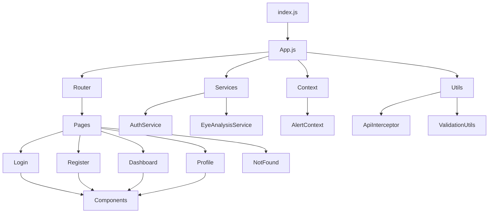
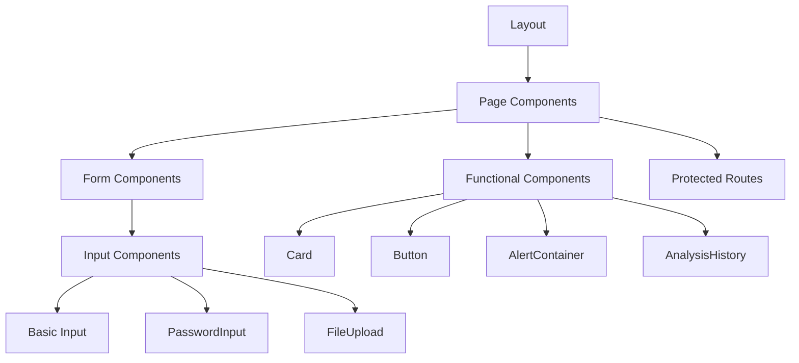
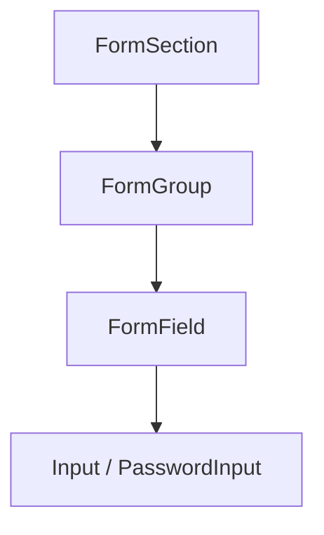
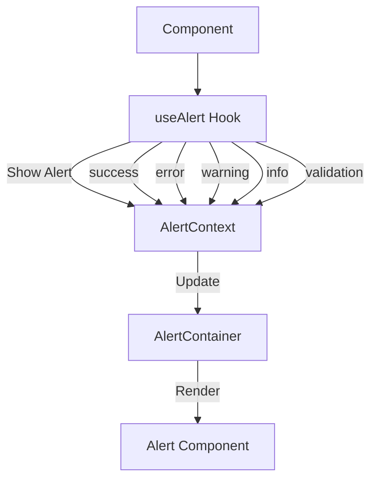
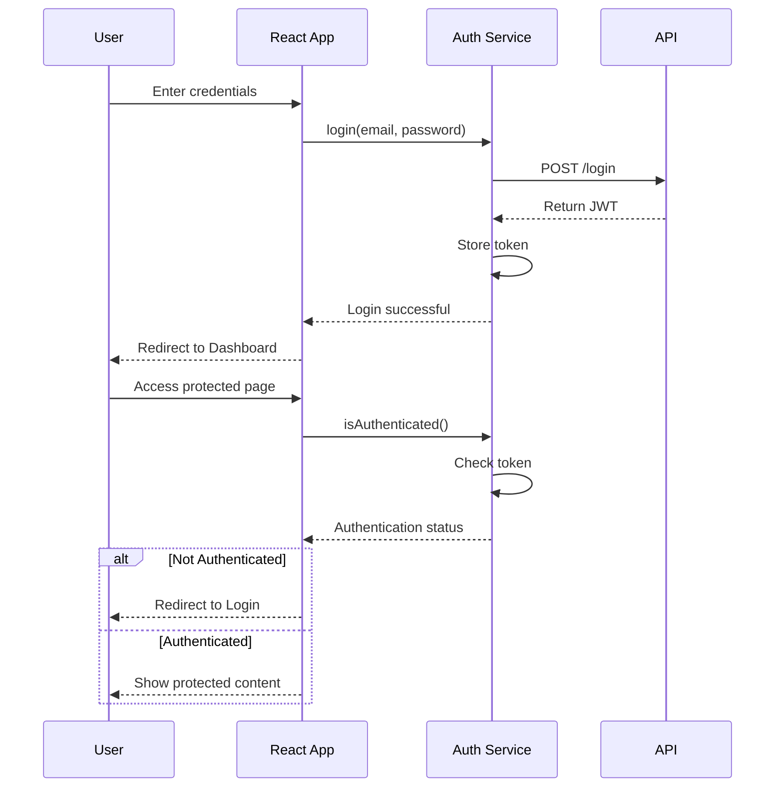
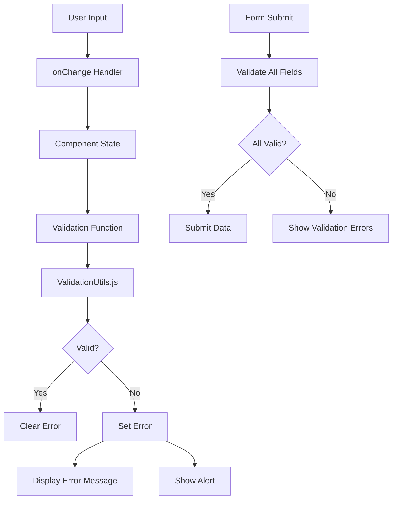
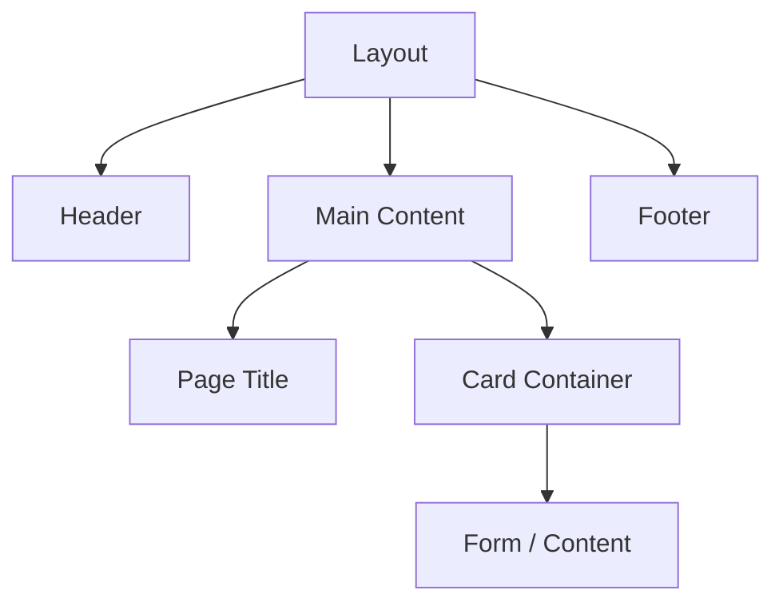

# Eye Disease Detection Frontend Documentation

This document provides a comprehensive overview of the Eye Disease Detection frontend application, including its architecture, component hierarchy, data flow, and key implementation details.

## Table of Contents

1. [Architecture Overview](#architecture-overview)
2. [Component Hierarchy](#component-hierarchy)
3. [Form Components](#form-components)
4. [Alert System](#alert-system)
5. [Authentication Flow](#authentication-flow)
6. [Form Validation](#form-validation)
7. [Page Structure](#page-structure)
8. [Best Practices](#best-practices)

## Architecture Overview

The Eye Disease Detection frontend is built using React with a modular component-based architecture, following a clear separation of concerns:



The architecture consists of:

- **Pages**: Container components that represent different routes in the application
- **Components**: Reusable UI elements used across different pages
- **Contexts**: React context for global state management (alerts, authentication)
- **Services**: API communication and business logic
- **Utils**: Utility functions for validation, data formatting, and error handling

## Component Hierarchy

The application follows a nested component hierarchy for better reusability and maintainability:



## Form Components

Form components are designed with a hierarchical structure to maintain consistency and improve developer experience:



### FormSection

The `FormSection` component serves as a container for logically related form elements:

```javascript
<FormSection 
  title="Personal Information" 
  description="Please provide your personal details"
  bordered
  collapsible
  defaultOpen={true}
>
  {/* Form content goes here */}
</FormSection>
```

Key features:
- Sections with titles and descriptions
- Collapsible sections for complex forms
- Optional borders for visual separation

### FormGroup

The `FormGroup` component organizes related form fields with consistent spacing and layout:

```javascript
<FormGroup layout="grid" columns={2}>
  {/* Related form fields */}
</FormGroup>
```

Supported layouts:
- `vertical` (default): Fields stacked vertically
- `horizontal`: Label and input side-by-side
- `grid`: Multi-column grid of form fields

### FormField

The `FormField` component wraps the base `Input` with additional features:

```javascript
<FormField
  label="Email"
  type="email"
  name="email"
  value={email}
  onChange={handleChange}
  required
  error={validationErrors.email}
  showValidation
  isValid={isValidEmail(email)}
  helpText="We'll never share your email"
/>
```

Features:
- Consistent label styling
- Error message display
- Built-in validation state visualization
- Help text support

### Input Component

The base `Input` component includes:

```javascript
<Input
  label="Username"
  type="text"
  name="username"
  value={username}
  onChange={handleChange}
  placeholder="Enter username"
  required
  error={error}
  isValid={isValid}
  showValidation={true}
  helpText="Choose a unique username"
/>
```

Features:
- Support for all input types
- Validation state visualization
- Accessible error messages
- Visual checkmark for valid inputs

### PasswordInput Component

The specialized `PasswordInput` extends the base Input with password-specific features:

```javascript
<PasswordInput
  label="Password"
  name="password"
  value={password}
  onChange={handleChange}
  showStrengthMeter
  showRequirements
  validateOnChange
/>
```

Features:
- Password visibility toggle
- Password strength meter
- Password requirements list
- Real-time validation

## Alert System

The application uses a centralized alert system implemented with React Context:



### Alert Context

The `AlertContext` provides a flexible API for displaying notifications:

```javascript
// In a component
const { success, error, warning, info, validation } = useAlert();

// Usage
success('Profile updated successfully');
error('Failed to connect to server');
warning('Your session will expire soon');
info('New features are available');
validation('Please fix the validation errors');
```

### Alert Types and Styling

The alert system supports different types of alerts, each with its own styling:

| Type | Color | Icon | Use Case |
|------|-------|------|----------|
| Success | Green | Checkmark | Successful operations |
| Error | Red | X | Operation failures |
| Warning | Yellow | Triangle | Potential issues |
| Info | Blue | Information | Neutral information |
| Validation | Purple | Question mark | Form validation errors |

### Alert Container

The `AlertContainer` component renders alerts in a fixed position at the top-right of the screen:

```javascript
<div className="fixed top-4 right-4 z-50 w-full max-w-md space-y-2">
  {alerts.map((alert) => (
    <Alert key={alert.id} {...alert} />
  ))}
</div>
```

Each alert includes:
- Colored icon representing the alert type
- The alert message
- A dismiss button

## Authentication Flow

The application implements a comprehensive authentication flow:



### Authentication Service

The `AuthService` provides methods for:

```javascript
// Login with credentials
AuthService.login(email, password)

// Register a new user
AuthService.register(userData)

// Check if user is authenticated
AuthService.isAuthenticated()

// Validate the current token
AuthService.validateToken()

// Logout the user
AuthService.logout()
```

### Protected Routes

Protected routes ensure users are authenticated before accessing certain pages:

```javascript
<Route 
  path="/dashboard" 
  element={
    <ProtectedRoute>
      <Dashboard />
    </ProtectedRoute>
  } 
/>
```

## Form Validation

The application uses a comprehensive validation system:



### Validation Utilities

The `ValidationUtils.js` file provides reusable validation functions:

```javascript
// Email validation
isValidEmail(email)

// Password validation
validatePasswordStrength(password)

// Password matching
passwordsMatch(password, confirmPassword)

// Name validation
validateName(name)

// Number validation
validateNumber(value, options)

// Required field validation
validateRequired(value)

// Calculate password strength
calculatePasswordStrength(password)
```

### Form Validation Flow

Form validation follows a consistent pattern:

1. User inputs data in a form field
2. `onChange` handler updates component state
3. Validation function checks input validity
4. Validation errors are stored in component state
5. Error messages are displayed inline and/or as alerts
6. On form submission, all fields are validated before proceeding

## Page Structure

Each page in the application follows a consistent structure:



### Layout Component

The `Layout` component provides a consistent structure for all pages:

```javascript
<Layout>
  <div className="max-w-4xl mx-auto px-4 sm:px-6 lg:px-8 py-10">
    <h1 className="text-3xl font-bold text-gray-900 mb-6">Page Title</h1>
    
    <Card>
      {/* Page content */}
    </Card>
  </div>
</Layout>
```

### Login Page

The login page demonstrates the standard page structure:

```javascript
<div className="min-h-screen flex">
  {/* Left Side - Login Form */}
  <div className="w-full lg:w-1/2 flex flex-col justify-center items-center p-8 bg-white">
    <div className="max-w-md w-full space-y-8">
      {/* Form content */}
    </div>
  </div>
  
  {/* Right Side - Image */}
  <div className="hidden lg:block lg:w-1/2 relative">
    
    <div className="absolute inset-0 bg-gradient-to-r from-blue-500 to-purple-600 opacity-60"></div>
    <div className="absolute inset-0 flex flex-col justify-center items-center text-white p-12">
      <h1 className="text-4xl font-bold mb-4 text-center">Eye Disease Detection</h1>
      <p className="text-xl text-center max-w-lg">
        Upload your eye images and get instant analysis powered by advanced AI technology.
      </p>
    </div>
  </div>
</div>
```

## Best Practices

The codebase follows several best practices:

### 1. Component Composition

Components are designed to be composable, with each component responsible for a specific task:

```javascript
<FormSection title="Personal Information">
  <FormGroup layout="grid" columns={2}>
    <FormField label="First Name" name="firstName" {...props} />
    <FormField label="Last Name" name="lastName" {...props} />
  </FormGroup>
</FormSection>
```

### 2. Separation of Concerns

The codebase separates:
- Presentation (Components)
- State management (Context)
- API communication (Services)
- Business logic (Utils)

### 3. Consistent Error Handling

Error handling follows a consistent pattern using the alert system:

```javascript
try {
  // API call or operation
  success('Operation successful');
} catch (err) {
  error('Failed to complete operation: ' + err.message);
}
```

### 4. Responsive Design

All components are designed to be mobile-responsive using Tailwind CSS:

```javascript
<div className="w-full sm:w-1/2 md:w-1/3 lg:w-1/4">
  {/* Content adapts to different screen sizes */}
</div>
```

### 5. Accessibility

Components include accessibility features:

```javascript
<input
  aria-invalid={error ? 'true' : 'false'}
  aria-describedby={error ? `${name}-error` : undefined}
/>
{error && (
  <p id={`${name}-error`} className="text-red-600">
    {error}
  </p>
)}
```

## Conclusion

The Eye Disease Detection frontend application demonstrates a well-structured React application with modular components, consistent styling, and comprehensive validation. By understanding this documentation, developers can effectively maintain and extend the application.
